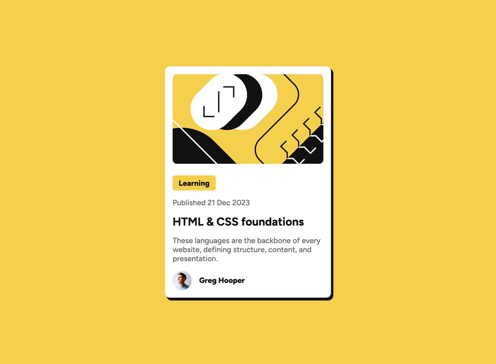

# Frontend Mentor - Blog preview card solution

This is a solution to the [Blog preview card challenge on Frontend Mentor](https://www.frontendmentor.io/challenges/blog-preview-card-ckPaj01IcS). Frontend Mentor challenges help you improve your coding skills by building realistic projects.

## Table of contents

- [Overview](#overview)
  - [The challenge](#the-challenge)
  - [Screenshot](#screenshot)
  - [Links](#links)
- [My process](#my-process)
  - [Built with](#built-with)
  - [What I learned](#what-i-learned)
  - [Continued development](#continued-development)
  - [Useful resources](#useful-resources)

**Note: Delete this note and update the table of contents based on what sections you keep.**

## Overview

### The challenge

Users should be able to:

- See hover and focus states for all interactive elements on the page

### Screenshot



### Links

- GitHub Repo: [https://github.com/diegoloradigital/blog-preview-card](https://github.com/diegoloradigital/blog-preview-card)
- Live Site URL: [https://diegoloradigital.github.io/blog-preview-card/](https://diegoloradigital.github.io/blog-preview-card/)

## My process

### Built with

- Semantic HTML5 markup
- CSS custom properties
- Flexbox
- Mobile-first workflow

### What I learned

I used a a flex container on `<main>` tag to center the card, then I create a another flex container inside the card `<article class="card-wrapper">` using a class which allow me to control the alignment and space between elements on that component. Then I use one more nested flex container for the avatar profile and its name on <div class="card-wrapper">.

I heard Kevin Powell said that is better using the word wrapper instead of container to not confused it with 'container queries'. I am not sure if this tip is useful for Tailwind CSS or Bootstrap.

```html
<main>
  <article class="card-wrapper">
    
    <span class="article-category">Learning</span>
    <p>Published 21 Dec 2023</p>
    <h2><a href="#">HTML & CSS foundations</a></h2>
    <p>
      These languages are the backbone of every website, defining structure,
      content, and presentation.
    </p>
    <div class="avatar-wrapper">
      <span>Greg Hooper</span>
    </div>
  </article>
</main>
```

`<span>` tags are useful along with `span {width: fit-content}` to only take the space of their width even though I convert them in flex items that behaves like display block.

```css
.article-category {
  background-color: var(--main-background-color);
  width: fit-content;
  font-weight: 800;
  padding: 0.4em 0.8em;
  border-radius: 5px;
}
```

code related to the hover and focus states:

```css
a {
  text-decoration: none;
  color: var(--gray-950);
}

a:active,
a:hover {
  color: var(--main-background-color);
}

a:focus-visible {
  color: var(--main-background-color);
  outline-color: var(--gray-500);
  padding-block: 0.5rem;
}
```

I nested this block code inside `.card-wrapper` (see style.css for more reference).

### Continued development

My main issue with CSS is layout control on inline elements like `` and `<button>` when they are used on normal flow (no flex item or grid item).

I would like to keep investigating about fit content property on width, as well as other options availables for different screen sizes responsiveness on images.

### Useful resources

Helpful YouTube channels with tutorials:

- [Kevin Powel](https://www.youtube.com/@KevinPowell)
- [Coding2G0](https://www.youtube.com/@coding2go)

## Author

- Frontend Mentor - [@diegoloradigital](https://www.frontendmentor.io/profile/diegoloradigital)
- X - [@diego_lora\_](https://x.com/diego_lora_)
